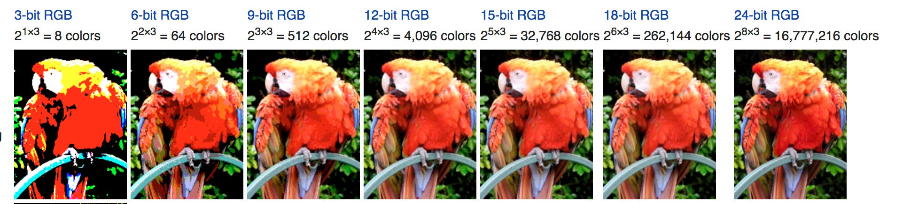
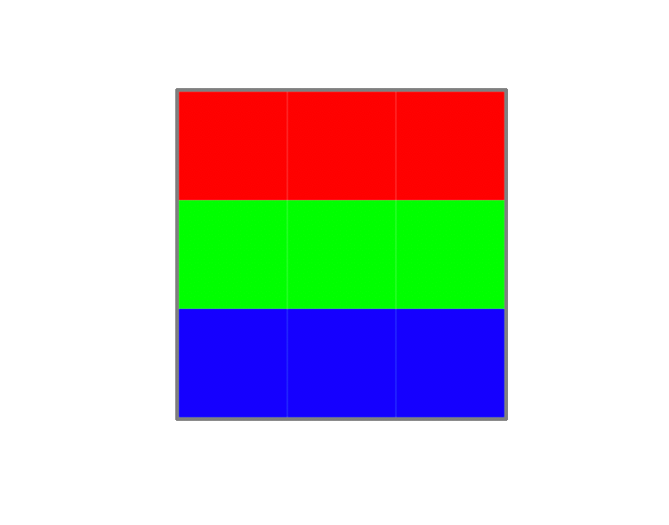
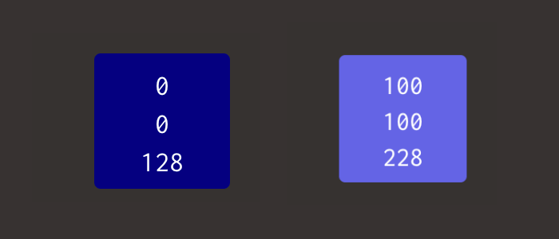
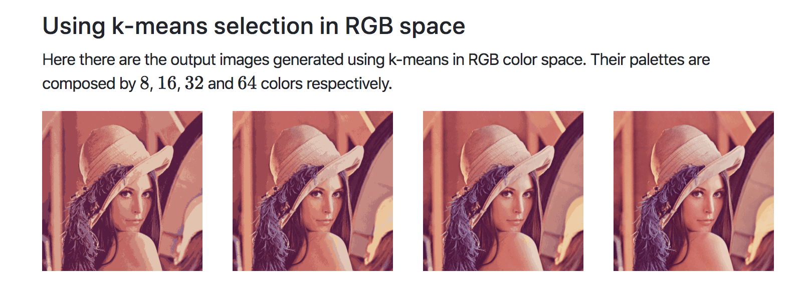

# Image color palette extraction for color-blinded people

## Team

*All the members are from the Department of Computer Science at Hanyang University (South Korea)*

- Ni Putu Winda Ardiyanti
- Asty Nabilah Izzaturrahmah
- Stanislas Lange
- Stephane Rabenarisoa

## I. Introduction

- Motivation: Why are you doing this? - What do you want to see at the end?

The goal of our project is to help color-blinded people through our service.

According to [Wikipedia](https://en.wikipedia.org/wiki/Color_blindness):

> Color blindness, also known as color vision deficiency, is the decreased ability to see color or differences in color.

Our service is a website available for free where users can upload a picture, and from that picture get the major tints of an image. The human ability to recognize colors is not absolute and can be tricked through the use of tints. Color recognition is even harder for color blinded people, thus we want to help them by giving them the dominant color of an image, also known as color palette.

To achieve this, we use multiple algorithms. The first one will extract the major colors from an image (the number of colors is configurable), and it will return them as hexadecimal or RGB values (see below for RGB). The second one will associate the color values with the closest color name in English for each color.

## II. Datasets

### Extracting colors: converting an image into a usable dataset

To analyze the colors of an image, we only need the image itself, which we can consider as our dataset. As we explain in `III.`, we use the k-means clustering algorithm for this matter.

An image can be broken down into a two-dimensional array for pixels, defined by its height and width, in pixels. Each pixel itself is a 3-dimensional array with a red, green and blue (RGB) value.

The RGB color model is an additive color model in which red, green, and blue light are added together in various ways to reproduce a broad array of colors.


*3D representation of a RGB pixel*

The RGB24 model is composed of 3 color channel each holding 8 bits of data, a value from 0 to 255 according to the amount of that specific color in the channel. Each pixel holds a total of 24 bits.


*Image represented as 3D matrix. Each layer is a color channel represented as a 2D matrix.*

24 bits is 256<sup>3</sup>. With this system, 16,777,216 (256<sup>3</sup> or 2<sup>24</sup>) discrete combinations of R, G, and B values are allowed, providing millions of different (though not necessarily distinguishable) hue, saturation and lightness shades, which results in different colors, or tints.



*Images with pixels of different bit depth also known as color depth. The standard is 24-bits.*

There are other color models but the second most popular is the CMY color model (for Cyan, Magenta and Yellow), which is a subtractive color model as opposed to RGB which is additive.

To extract the dominant colors from an image we don't care about the placement of the pixels in the image, but only their color. Thus, we can convert the image into an array of RGB values.

Let's take this image as a example:



*3x3 image*

This image is our dataset, and we will prepare it for our clustering algorithm.

We use OpenCV in Python to manipulate the image:

```py
import cv2
```

When reading a color image file, OpenCV `imread()` reads as a NumPy array `ndarray` of row (height) x column (width) x color (3). The order of color is BGR (blue, green, red). So we have to convert it to RGB.

```py
img = cv2.imread('3x3.png')

img = cv2.cvtColor(img, cv2.COLOR_BGR2RGB)
```

If we `print(img)` now we will have a 3D array as expected:

```py
[[[255   0   0]
  [255   0   0]
  [255   0   0]]

 [[  0 255   0]
  [  0 255   0]
  [  0 255   0]]

 [[  0   0 255]
  [  0   0 255]
  [  0   0 255]]]
```

Since we don't care about the pixel placement we can convert the image to a 2D array, which can be seen as reshaping the image from 3x3 pixels to 1x9 pixels.

```py
img = img.reshape((img_data.shape[0] * img_data.shape[1], 3))
```

Now by issuing `print(img)` we can attest that we have prepared our image for the clustering.

```py
[[  0   0 255]
 [  0   0 255]
 [  0   0 255]
 [  0 255   0]
 [  0 255   0]
 [  0 255   0]
 [255   0   0]
 [255   0   0]
 [255   0   0]]
```

### Associating color values with color names

With the methodology described below we extract a certain number of dominant colors as RGB or Hexadecimal values. Since this not something that will help our user (what's the good of knowing that `123,43,234` is the dominant tint in an image?), we have to provide them with a name corresponding to each color.

To that end we use a CSV dataset available [here](../../dataset/wikipedia_color_names.csv) containing 1298 colors.

Here is an extract:

```csv
"name","hex","red","green","blue","hue","hsl_s","hsl_l, hsv_s, hsv_v"
"Absolute zero","#0048BA",0,72,186,217.0,100.0,37.0
"Acid green","#B0BF1A",176,191,26,65.0,76.0,43.0
"Aero","#7CB9E8",124,185,232,206.0,70.0,70.0
"Aero blue","#C9FFE5",201,255,229,151.0,100.0,89.0
"African violet","#B284BE",178,132,190,288.0,31.0,63.0
```

That dataset originally comes from [Wikipedia (List of colors)](https://en.wikipedia.org/wiki/Lists_of_colors) and has been converted to CSV by Dilum Ranatunga and published on [data.world](https://data.world/dilumr/color-names).

We need to import and prepare that dataset because we only need the first four columns in the CSV file.

To do so we use the [pandas](https://pandas.pydata.org/) library.

```py
import pandas as pd
```

First we convert the CSV file to a `pandas.core.frame.DataFrame` object to easily extract data.

```py
data = pd.read_csv("wikipedia_color_names.csv")
```

We can verify the import with the `data.head()` method:

```py
             name      hex  red  green  blue    hue  hsl_s  hsl_l, hsv_s, hsv_v
0   Absolute zero  #0048BA    0     72   186  217.0  100.0                 37.0
1      Acid green  #B0BF1A  176    191    26   65.0   76.0                 43.0
2            Aero  #7CB9E8  124    185   232  206.0   70.0                 70.0
3       Aero blue  #C9FFE5  201    255   229  151.0  100.0                 89.0
4  African violet  #B284BE  178    132   190  288.0   31.0                 63.0
```

Then we extract the name and RGB values into 4 variables.

```py
color_names = data['name'].tolist()
r = data['red'].tolist()
g = data['green'].tolist()
b = data['blue'].tolist()
```

We are careful to keep the order of the data when converting them to list, otherwise the colors will be mixed.

Now that we have extracted the data we needed, we will be able to use it for our classifying algorithm below.

## III. Methodology

### Tools and libraries used

- Flask: Python backend and API backend
- Bootsrap: frontend styling
- jQuery: handling of AJAX queries and DOM manipulation
- sklearn: Machine Learning library we used for k-means and K-NN
- pandas: data analysis library, used for handling the CSV dataset
- OpenCV: computer vision library, used to manipulate the image
- imutils: wrapper around OpenCV
- Heroku: Hosting of the flask application
- GitHub Action: CI and auto deploy to Heroku

### Extracting colors: k-means clustering

To explain why we chose k-means for our project we have to go back to what we try to achieve. After processing our image as explained above, we want to extract `x` dominant colors. However as we saw earlier using the RGB 24-bits color model we has 16,777,216 (256<sup>3</sup> or 2<sup>24</sup>) different colors, most of which being slightly different tints.

To understand the extent of the spectrum, let's look at this rough example:



One would classify both of these color as blue, right? The second color has +100 to each color channel, so that means there is 100<sup>3</sup> = 1 million tints between these two blue colors!

To be specific, if we want the *most present colors* in an image, we could do a simple statistical analysis of the RGB values of all the pixels. But the result would be extremely difficult to interpret, because an image of a blue sky can contain a million different tints of blue and be made of unique pixels, thus without any *exact* dominant color.


*This image is clearly blue, but a statistical analysis would not be as decisive.*

But that's not how humans perceive colors. According to [Deane Brewster Judd and Günter Wyszecki in their book *Color in Business, Science and Industry* published in 1975](https://en.wikipedia.org/wiki/Color_vision#cite_note-business-21), humans can perceive about 10 millions colors. But humans can't tell the difference between very slight tints differences.

Consequently, we want our service to group close tints as a single color. For example if we want to extract the two dominant colors of a landscape image with a blue sky and green grass, our service should group all the tints of blue in the sky as a single blue color and all the tints of green in the grass as a single green color.

In order to achieve this programmatically, we have to use **clustering**.

Clustering is a Machine Learning technique that involves the grouping of data points. Given a set of data points, we can use a clustering algorithm to classify each data point into a specific group. In theory, data points that are in the same group should have similar properties and/or features, while data points in different groups should have highly dissimilar properties and/or features. Clustering is a method of unsupervised learning and is a common technique for statistical data analysis used in many fields.

An **unsupervised learning** method is a method in which we draw references from datasets consisting of input data without labeled responses. Generally, it is used as a process to find meaningful structure, explanatory underlying processes, generative features, and groupings inherent in a set of examples.

There are multiple types of clustering algorithm. But k-means is the easiest to implement and use, and our data is simple enough and well distributed enough (generally) that k-means will be able to clusterize correctly the data, most of the time.

So, how does k-means work?

1. To begin, we first select a number of classes/groups (later called clusters) to use and randomly initialize their respective center points, called centroids. To figure out the number of classes to use, it’s good to take a quick look at the data and try to identify any distinct groupings.

2. Each data point is classified by computing the distance between that point and each group center, and then classifying the point to be in the group whose center is closest to it.

3. Based on these classified points, we recompute the group center by taking the mean of all the vectors in the group.

4. Repeat these steps for a set number of iterations or until the group centers don’t change much between iterations. You can also opt to randomly initialize the group centers a few times, and then select the run that looks like it provided the best results.


*The centroids are chosen to be the 4 points of the left, and then they are recomputed through each iteration.*


*A sequential visualization of k-means*

K-Means has the advantage that it’s pretty fast, as all we’re really doing is computing the distances between points and group centers; very few computations! It thus has a linear complexity O(n).

On the other hand, K-Means has a couple of disadvantages. Firstly, you have to select how many groups/classes there are.

This isn’t always trivial and ideally with a clustering algorithm we’d want it to figure those out for us because the point of it is to gain some insight from the data. However in our case we decided that we want the user to provide the number of dominant colors they want to extract from the image, so it's all good.


*In our case, are data points are three-dimensional (RGB) so the clustering process would look like this.*

K-means also starts with a random choice of cluster centers and therefore it may yield different clustering results on different runs of the algorithm. Thus, **the results may not be repeatable and lack consistency**. K-means is **not deterministic**. Other cluster methods are more consistent.
K-Medians is another clustering algorithm related to K-Means, except instead of recomputing the group center points using the mean we use the median vector of the group. This method is less sensitive to outliers (because of using the Median) but is much slower for larger datasets as sorting is required on each iteration when computing the Median vector.


*The choice of initial centroids can lead to completely different and wrong results*

As shown below, even if the random initialization of centroids will lead to corrects results most of the time, it can sometimes completely mess up the clustering.

To overcome the above-mentioned drawback we use K-means++. This algorithm ensures a smarter initialization of the centroids and improves the quality of the clustering. Apart from initialization, the rest of the algorithm is the same as the standard K-means algorithm. That is K-means++ is the standard K-means algorithm coupled with a smarter initialization of the centroids.

The steps involved are:

1. Randomly select the first centroid from the data points.
2. For each data point compute its distance from the nearest, previously chosen centroid.
3. Select the next centroid from the data points such that the probability of choosing a point as centroid is directly proportional to its distance from the nearest, previously chosen centroid. (i.e. the point having maximum distance from the nearest centroid is most likely to be selected next as a centroid)
4. Repeat steps 2 and 3 until k centroids have been sampled

By following the above procedure for initialization, we pick up centroids which are far away from one another. This increases the chances of initially picking up centroids that lie in different clusters.


*With this dataset, we can expect that by using k-means++ initialization, the initial centroids will be roughly associated with the apparent clusters nearly all the time, whereas the probability of this happening with the random initialization is much lower.*

Since this is a easy improvement for k-means, we decided to use the k-means++ initialization method over the default, random one. Moreover, this method is available natively in the library we use.

Let's run through our usage of k-means in Python. Since Python is blessed with excellent Machine Learning libraries such as [scikit-learn](https://scikit-learn.org/stable/), we did not have to re-implement k-means from scratch, although it is possible to be done in a [few dozen lines of code](https://github.com/pavankalyan1997/Machine-learning-without-any-libraries/blob/master/2.Clustering/1.K_Means_Clustering/Kmeans.py) since the algorithm itself is pretty trivial.

```py
from sklearn.cluster import KMeans
```

Let's start by initializing k-means and our model:

```py
k = 3
model = KMeans(n_clusters = k,
                init = 'k-means++',
                n_jobs = -1,
                n_init = 10,
                max_iter = 300,
                algorithm='auto')
```

In the real application we get `k` from the API, but for simplicity here we will use `k=3` as the number of clusters, which means the number of centroids, so number of colors to extract.

As explained above, we use k-means++ as our initialization method, the two other supported being random and a defined set of points as a `ndarray`.

`n_jobs = -1` means we will use all the available CPU cores instead of 1. `n_init` is the number of times the k-means algorithm will be run with different centroid seeds. The final results will be the best output of n_init consecutive runs in terms of inertia. `max_iter` is the maximum number of iterations of the k-means algorithm for a single run.

Then we compute our clusters using our transformed array image:

```py
model.fit(img)
```

This will take from a few milliseconds to a few seconds depending on the image size, the number of clusters and other parameters above such as the number of iterations.

If we take our simple 3x3 image example from earlier:

```py
[[  0   0 255]
 [  0   0 255]
 [  0   0 255]
 [  0 255   0]
 [  0 255   0]
 [  0 255   0]
 [255   0   0]
 [255   0   0]
 [255   0   0]]
```

And compute its centroids (3), we get, as expected, red, green, and blue:

```py
print(model.cluster_centers_.astype(int))
```

```py
[[255   0   0]
 [  0 255   0]
 [  0   0 255]]
```

Now, with 2 clusters, we get purple and green:

```py
[[127   0 127]
 [  0 255   0]]
```

That helps showing the importance in the number of clusters, however the effect is amplified by the fact that our dataset here is extremely small. In a real image, k-means would give more real tints.

For example, a picture of a blue sky and `k=1` will give use some blue color. But with `k=2`, we will get a light blue and dark blue.

### Classifying colors values as color names: k-nearest neighbors

The k-nearest neighbors (K-NN) algorithm is a simple, easy-to-implement supervised machine learning algorithm that can be used to solve both classification and regression problems.

A supervised machine learning algorithm (as opposed to an unsupervised machine learning algorithm) is one that relies on labeled input data to learn a function that produces an appropriate output when given new unlabeled data.

A classification problem has a discrete value as its output are discrete (true or false, 1 or 0). A regression problem has a real number (a number with a decimal point) as its output.


Here's how K-NN works:

1. Load the data
2. Initialize K to your chosen number of neighbors
3. For each example in the data
3.1 Calculate the distance between the query example and the current example from the data.
3.2 Add the distance and the index of the example to an ordered collection
4. Sort the ordered collection of distances and indices from smallest to largest (in ascending order) by the distances
5. Pick the first K entries from the sorted collection
6. Get the labels of the selected K entries
7. If regression, return the mean of the K labels
8. If classification, return the mode of the K labels


Here we somewhat abused K-NN to have a simple manner to calculate the distance between two data points in a dataset.

Remember our dataset earlier:

```py
             name      hex  red  green  blue    hue  hsl_s  hsl_l, hsv_s, hsv_v
0   Absolute zero  #0048BA    0     72   186  217.0  100.0                 37.0
1      Acid green  #B0BF1A  176    191    26   65.0   76.0                 43.0
2            Aero  #7CB9E8  124    185   232  206.0   70.0                 70.0
3       Aero blue  #C9FFE5  201    255   229  151.0  100.0                 89.0
4  African violet  #B284BE  178    132   190  288.0   31.0                 63.0
```

Now, we just want a simple manner of associating whatever color we got from k-means with a color name. To do so, we use K-NN with `k=1`. Why? Because we don't have duplicate labels in our dataset so the tint name of a said color is necessarily its closest neighbor. Using multiple neighbors can sometimes lead to the same result of another close tint name, but it's based on randomness, so it does not make sense for use.

After preparing and dividing our dataset earlier, we have to do some boring work and encode it for the K-NN library we use:

```py
le = preprocessing.LabelEncoder()

r_encoded = le.fit_transform(r)
g_encoded = le.fit_transform(g)
b_encoded = le.fit_transform(b)
features = list(zip(r_encoded,g_encoded,b_encoded))

labels = le.fit_transform(color_names)
```

We combine all the R/G/B values into a single **features** list and the names into a list called **labels**.

Finally, we convert our unencoded dataset into dict, which is key-value list in Python that will help use associate the K-NN result with the actual color name. The workflow is as follow: RGB value -> K-NN -> label id -> color name.

```py
target_colors = dict(zip(labels, color_names))
```

Next, we process our model and classify all the colors of our dataset, (one RGB value = on distinct label).

```py
model = KNeighborsClassifier(n_neighbors=1)

model.fit(features, labels)
```

After processing an image with k-means, we can send each tint to K-NN, and K-MM will predict the color name and return a string based on the dict we created earlier:

```py
label_result = model.predict([[r,g,b]])[0]
color_name = target_colors[int(label_result)]
return color_name
```

That's it!

## IV. Evaluation & Analysis

It it difficult to evaluate the precision of k-means because the point of an unsupervised learning algorithm is to detect previously unknown patters of data in a dataset. Moreover, we cannot compare the resulting clusters into pre-made labels because we don't use k-means to precisely classify the data but to get an average of the major data points to get the tints.

If we had labels associated with our dataset we could use something called cluster purity.

According to a [Stanford University professor](https://nlp.stanford.edu/IR-book/html/htmledition/evaluation-of-clustering-1.html):

> To compute purity, each cluster is assigned to the class which is most frequent in the cluster, and then the accuracy of this assignment is measured by counting the number of correctly assigned documents and dividing by N.

But that required to have pre-made clusters or labels, which we don't have.

The best evaluation we can do is to eyeball to result and roughly determine if the results match the image. For instance during the implementation a bug mixed the order of the RGB values in the results so the color were wrong, and even do we can't really evaluate tints we could roughly say that these results were wrong.

Regarding K-Nn, since we only use the k=1 nearest neighbor, our result can't be biased since our dataset covers the whole RGB spectrum. If we had less colors or multiple values for the same label, result could have been biased, but here if we assume that our dataset is 100% correct, then all the results are 100% correct.

## V. Related Work

### Image compression with color quantization using k-means

Among the related work in images with k-means, one of the most interesting is lossy image compression. It is easy to understand how this is a good application: lossy compression means we're losing data, and with k-means we can reduce similar data. Thus with k-means and let's say `k-128`, we can reshape and image to array and then back to an image afterward, but with less color tints. This is a simple and very effective way to save a lot of space on an image. This has been done multiple times be wan can link for example [Ben Fradet's blog](https://benfradet.github.io/blog/2014/09/19/Using-KMeans-for-image-compression) where he uses Octave, a Matlab-like scientific programming language to use k-means. There is [similar work in Python](https://lmcaraig.com/color-quantization-using-k-means) as well, called color quantization.



### Image segmentation using k-means clustering

Another application is image segmentation, which aims at detecting major objects in an image based of colors. Obviously this can be biased if the colors are not distinct enough, but also based on lightning, etc.

We found this implementation in Python by [Nagesh Singh Chauhan](https://towardsdatascience.com/introduction-to-image-segmentation-with-k-means-clustering-83fd0a9e2fc3).


### Extracting dominant colors from an image with k-means

The process has been explained throughout this blog post but for completeness, we found other implementation in [Javascript](https://towardsdatascience.com/extracting-colours-from-an-image-using-k-means-clustering-9616348712be), in [R](http://www.milanor.net/blog/build-color-palette-from-image-with-paletter/), in [Python](https://buzzrobot.com/dominant-colors-in-an-image-using-k-means-clustering-3c7af4622036) and [Go](https://github.com/mccutchen/palettor).

## VI. Conclusion

Our project combines a supervised learning and unsupervised learning algorithm. To extract the dominant colors as RGB or Hex, we are using k-means clustering, and then we associate these results with a color names dataset using the k-nearest neighbor algorithm.

Overall this project was a really learning experience, because machine learning can be tough to get into especially considering how complex projects in the field can get. We chose this project because we could use k-means, which is an entry-level learning algorithm. As such, it is a learning material for a lot of machine learning students but also in related fields such as image processing and data science. The great advantage being that there is a lot of comprehensive learning material and implementations of similar projects. Also, we chose Python because of the high quality machine learning libraries available, and it has been a great asset.
Luckily while working on this project we discovered we could also use a supervised learning algorithm called K-Nn to enhance our software.

The most difficult part of our project was first understanding how to apply k-means to image processing. The fact that there is so much material on the subject can be quite confusing because each material has a slightly different goal and implementation can differ a lot: sometimes using libraries, sometimes from scratch. Once we understood K-means, it was easy to understand K-nn because it works in a related manner.

Once we had all each algorithm working, we just had to glue it up all together behind a website. Despite the apparent simplicity of our website, there is lot going on behind the scenes and we hope our blog post helped clear things up!


